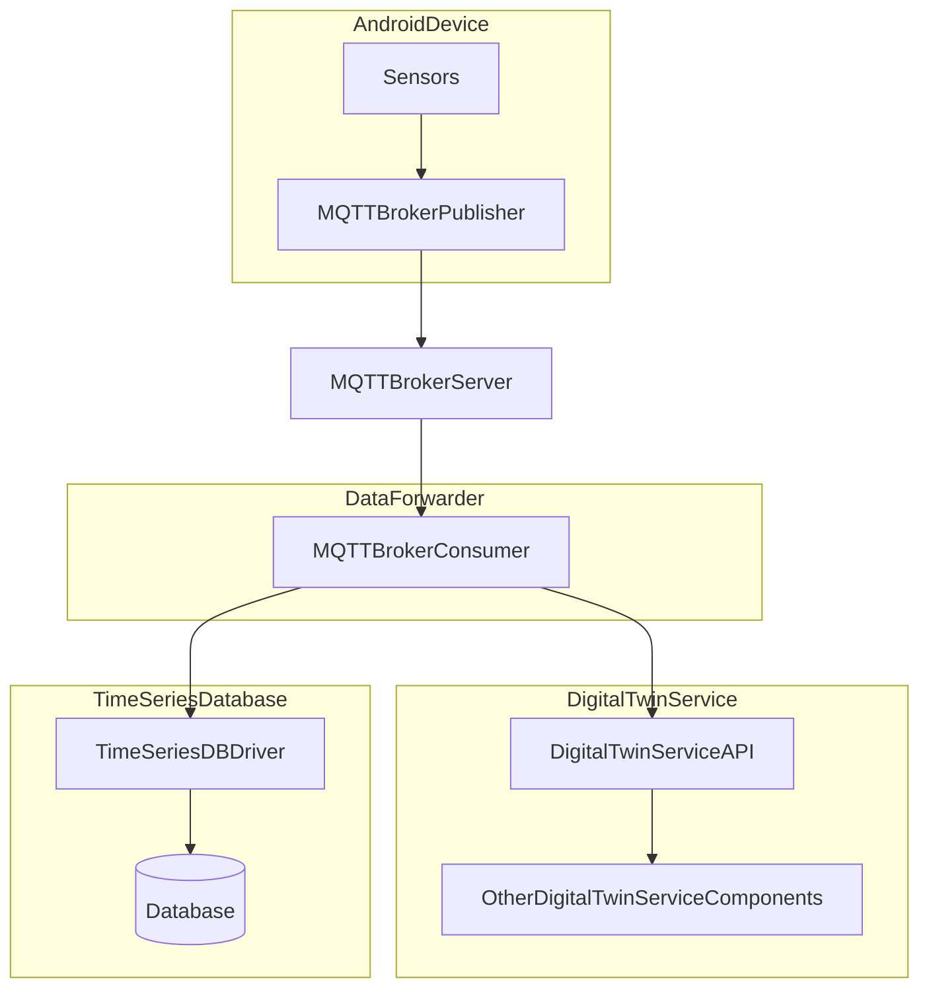

# Data Flow Diagram

```mermaid
flowchart TD
    subgraph AndroidDevice
        Sensors --> MQTTBrokerPublisher
    end

    MQTTBrokerPublisher --> MQTTBrokerServer
    MQTTBrokerServer --> MQTTBrokerConsumer

    subgraph DataForwarder
        MQTTBrokerConsumer
    end

    subgraph DigitalTwinService
        DigitalTwinServiceAPI --> OtherDigitalTwinServiceComponents
        MQTTBrokerConsumer --> DigitalTwinServiceAPI
    end

    subgraph TimeSeriesDatabase
        MQTTBrokerConsumer --> TimeSeriesDBDriver
        TimeSeriesDBDriver --> Database[(Database)]
    end

```
